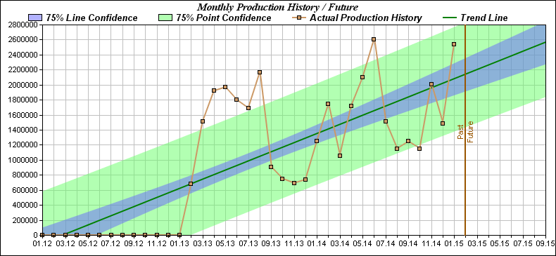
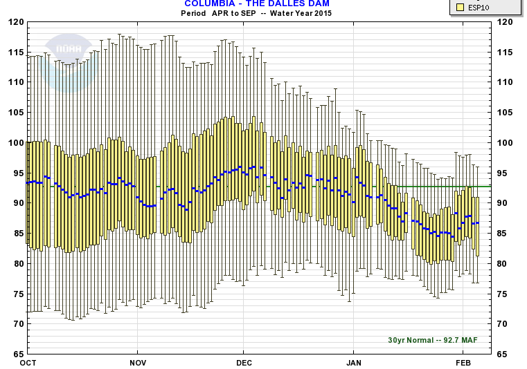
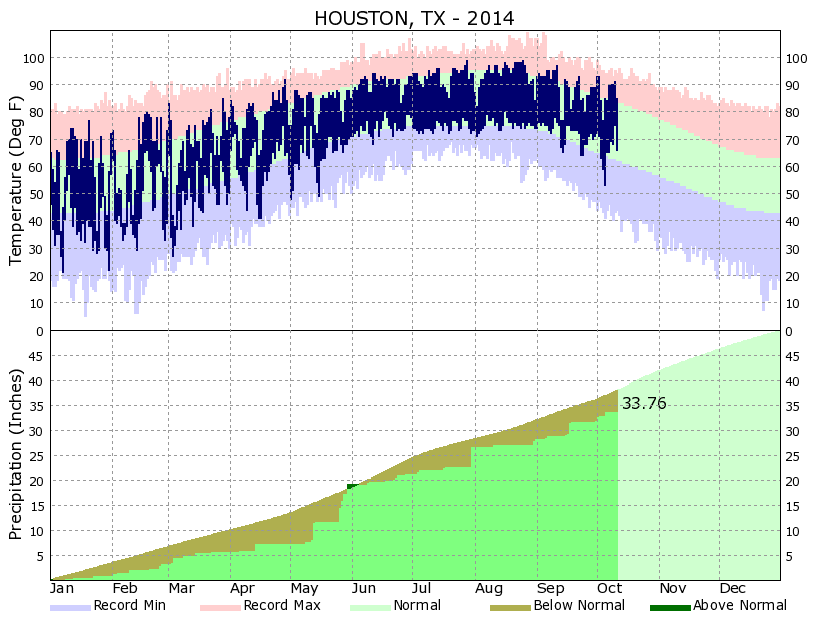

# Overview: Monte Carlo simulations for /r/PersonalFinance-style budgeting
## Inspiration

This project is inspired by:

* [PF] http://www.reddit.com/r/personalfinance  - Personal Finance
* [FI/RE] http://www.reddit.com/r/financialindependence  - Financial Independence / Early Retirement
* [cFIREsim] http://www.cfiresim.com/  - Crowdsourced FI/RE Simulator
* [BBP] https://www.youtube.com/watch?v=ENNaAWZZONE  - cundus Bandwidth Planning
* [MY] Own experience with analytics and risk simulation

## History

Right now, I'm using a huge Excel sheet with 50'000 random samples per variable (simulated with Monte Carlo). For 10 variables there are 0.5 million random samples, and so on. The Excel sheet performs the calculations for the current financial year, and provides a reliable forecast for the living expenses, "luxury/fancy spending" budget and the investment/savings budget. The example Excel sheet "MC_example_budgeting.xlsx" (without the actual values) is available in this directory.

The calculations are only as good as the input data. Hence, a good understanding of the personal income, tax, and expense streams (and accurate tracking of the monthly spending) is essential.

## Project goals

In this project, I'm adapting the well-known techniques of budgeting and financial planning to deliver the Net Worth simulation/forecasting scenario for 1, 5 and 10 years in the future. The simulation engine will be running in R instead of Excel.

## Visual examples

**Example 1:** Confidence bands for Folding@Home project (can be done with standard R methods of qplot() and geom_smooth()):




**Example 2:** More statistically meaningful confidence bands (implemented with box plots). The uncertainty will increase with every future year, of course.




**Example 3:** the ideal end result -> the upper part is the annual "delta", defined as IN - OUT, and the bottom part is a cumulative Net Worth plot influenced by the upper chart.




## Change log

**Already implemented in Excel (see file in the local directory):**

* v 1.0
    - Copied the template from the Internet

* v 1.1
    - Added all formulas and inputs. The spreadsheet is usable.
    - Added the 4x charts and some numerical info to the main tab

* v 1.2
    - Reworked the formulas based on triangle risk calculations; New calculation base of the sequence a,c,b is:
    - random(triangle) = a + sqrt(rand() * (b-a) * (c-a))
        - a = the worst-case estimate (lowest value)
        - c = the most likely estimate (value somewhere in between, based on subjective judgment)
        - b = the best-case estimate (highest value)
    - Now it actually matters where the "expected value" (c) is located.
    - Spreads were reduced from 10-20% to 5% (with my data)
    - On triangle distribution: 
        - http://en.wikipedia.org/wiki/Three-point_estimation
        - http://en.wikipedia.org/wiki/Triangular_distribution

**Wishlist - to be implemented in R**

* 1. Move the calculation engine to R; supplement a "private" flat file containing the actual financial numbers, and collect the output in form of tables and charts.
* 2. Break down the factors to several sub-elements, all aggregated by the group key A-Z (see excel)
* 3. Lump sum investments introduce an irregularity into the budgeting mechanisms, and therefore can't be easily forecasted ---> Split the investments into "actually done" and "planned" to track the quarterly progress.
* 4. Update the input data every quarter (see item 3)
* 5. Expand into a long-term forecast model: use this year's NetWorth and investment values to predict the Profit/Loss values for the next year ---> wash,rinse,repeat for 10 years with increasing spreads
* 6. Enhance the 10-year plot with given confidence bands (90%, 70%, 50%) and with the actual results at the end of every year. See example visualizations above.

# Technical remains from R Markdown - just for fun
This is an R Markdown document. Markdown is a simple formatting syntax for authoring HTML, PDF, and MS Word documents. For more details on using R Markdown see <http://rmarkdown.rstudio.com>.

When you click the **Knit** button a document will be generated that includes both content as well as the output of any embedded R code chunks within the document. You can embed an R code chunk like this:

```{r}
summary(cars)
```

You can also embed plots, for example:

```{r, echo=FALSE}
library(ggplot2)
qplot(speed, dist, data=cars) + geom_smooth()
```

Note that the `echo = FALSE` parameter was added to the code chunk to prevent printing of the R code that generated the plot.
