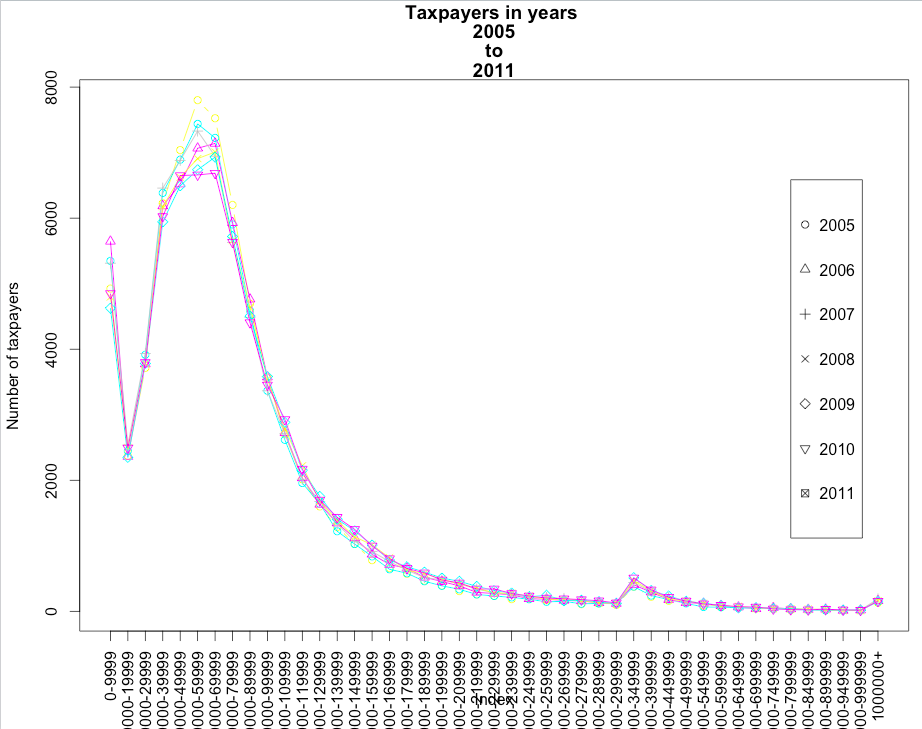

## Overview: Swiss Stats
This is an overview document for the Swiss Stats project (in the context of Sunlight).
The idea of this project is quite simple:

* Learn and practice the R basics
    + Getting the data from Internet
    + Data cleansing
    + Reproducible research using Open Data sources
    + Basic visualizations, plots and statistical calculations
* Write simple functions and collaborate with others
    + push the contents to GitHub
    + write the functions to calculate quantiles, join data, show correlations etc.
    + collaborate with others with forks and pull requests (via GitHub)

The project does not follow any "deeply practical" sense, but at the same time it's a very good test scenario to work with the basic R functionality (which will be needed in other projects)

## Status

* V1.0   - DONE
    - getdata(), transform()
    - If the files are not available in the current working directory, they will be downloaded and cleansed automatically (e.g. the Income_groups.csv file needs the removal of quotation marks)
* V1.1   - DONE
    - plot_income(), query_income()
    - The plotting funcionality is currently based on the "primitive" plot(), instead of lattice or ggplot2. I'm on it, the Coursera M4 W1 will explain exactly these parts. 
* V1.2   - TBD, another set of files, same functionality
    - plot_wealth(), query_wealth()
    - upgrade to lattice, introduce dynamic charts (shiny?), maybe histograms and box plots instead of lines.


## Examples

Result 1: plotting the number of taxpayers (by annual gross income bracket) for a single city, as a time series comparison between 2005 and 2011. All parameters (city, taxpayer group, interval of years) are fully customizable. The data is automatically downloaded and cleansed at the first run.



## Technical remains from R markup example - just for fun
This is an R Markdown document. Markdown is a simple formatting syntax for authoring HTML, PDF, and MS Word documents. For more details on using R Markdown see <http://rmarkdown.rstudio.com>.

When you click the **Knit** button a document will be generated that includes both content as well as the output of any embedded R code chunks within the document. You can embed an R code chunk like this:

```{r}
summary(cars)
```

You can also embed plots, for example:

```{r, echo=FALSE}
library(ggplot2)
qplot(speed, dist, data=cars) + geom_smooth()
```

Note that the `echo = FALSE` parameter was added to the code chunk to prevent printing of the R code that generated the plot.
